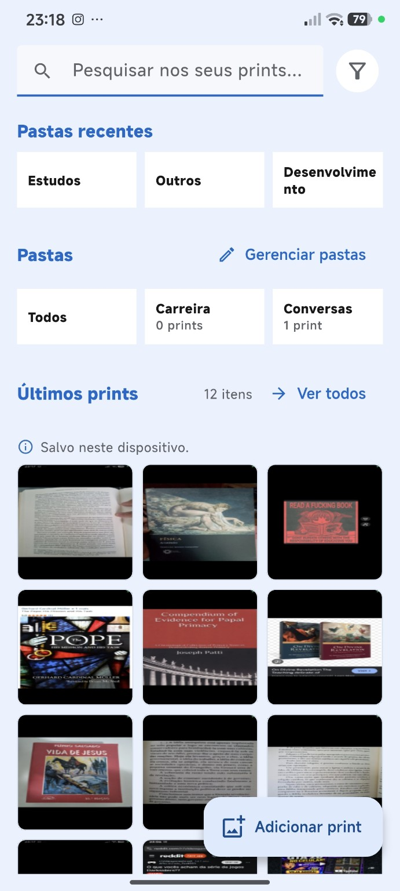
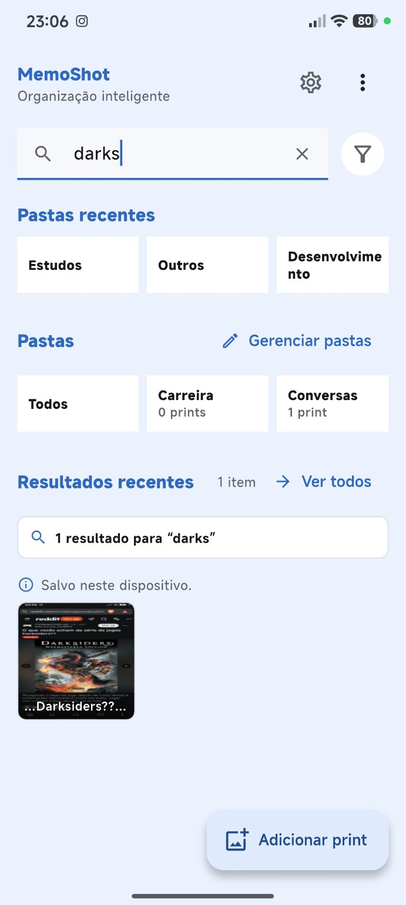
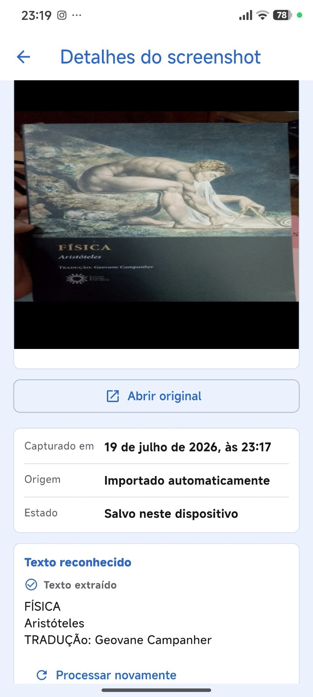
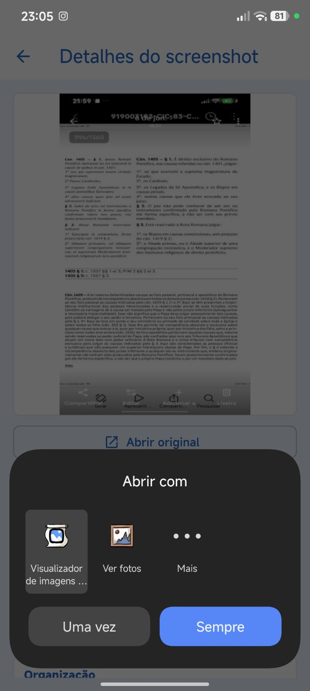
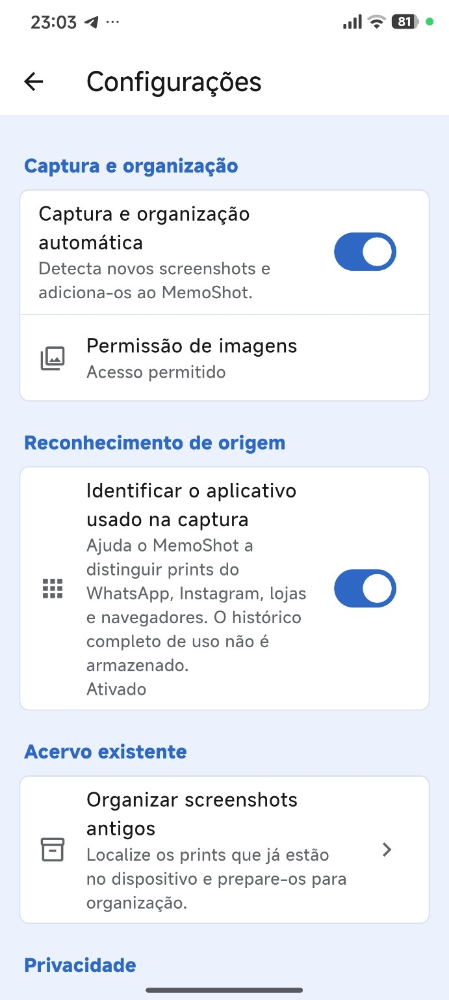
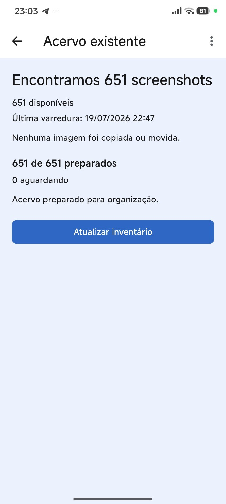
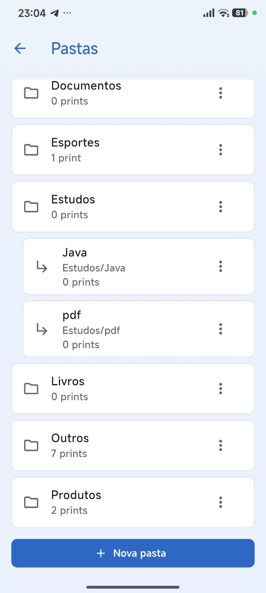

<a id="readme-top"></a>

<div align="center">
  <a href="imagens/home-com-prints.jpg">
    
  </a>

  <h1>MemoShot</h1>

  <p><strong>Capturou, organizou.</strong></p>

  <p>
    Aplicativo Android em desenvolvimento para detectar, pesquisar, organizar e
    recuperar screenshots utilizando OCR, contexto da captura e classificação
    inteligente.
  </p>

  <p>
    
    
    
  </p>

  <p>
    
    
    
    
  </p>

  <p>
    <a href="https://jeffersontadeu.vercel.app">
      
    </a>
    <a href="https://github.com/auhauhbr">
      
    </a>
    <a href="https://www.linkedin.com/in/jefferson-tadeu-dos-santos-0ab133380">
      
    </a>
  </p>
</div>

## Sobre o projeto

O MemoShot nasceu de uma necessidade pessoal: encontrar informações importantes
em um acervo de aproximadamente **6.700 screenshots** acumulados no celular.
Trechos de livros, vagas, produtos, soluções de programação, documentos,
conversas e referências vistas em navegadores ou redes sociais acabam misturados
em uma galeria cronológica difícil de consultar.

A proposta é transformar esse acervo em uma biblioteca pesquisável e organizada,
sem mover ou excluir o arquivo original. O projeto pode evoluir para um produto
ou aplicativo publicado, mas essa ainda é uma possibilidade — não uma promessa.

O teste atual utiliza um recorte de **651 screenshots existentes**. Nesse fluxo,
651 itens foram encontrados e preparados para organização, sem copiar ou mover
as imagens. Isso não significa que os 651 itens já tenham sido classificados
corretamente.

## O que já funciona

- detecção automática de novos screenshots no Android;
- importação manual e inventário de screenshots antigos;
- referência segura ao arquivo original por Content URI;
- OCR local e pesquisa no texto reconhecido;
- últimos prints na Home e biblioteca completa;
- pastas, subpastas e etiquetas;
- abertura do arquivo original com aplicativos compatíveis;
- processamento persistente e retomada de tarefas;
- identificação opcional do aplicativo usado no momento da captura;
- deduplicação e preservação dos arquivos originais.

A identificação opcional pode reconhecer contextos como WhatsApp, Instagram,
Amazon, Brave, Chrome e outros aplicativos Android. Esse sinal não decide a
organização sozinho: um print feito no WhatsApp pode conter um livro, uma vaga,
material de estudo ou apenas uma conversa comum. Da mesma forma, uma captura no
Brave pode mostrar Reddit, Amazon, um PDF, um livro ou uma publicação sobre
jogos.

## Fluxo atual

```text
Screenshot novo
→ detecção pelo Android
→ referência ao arquivo
→ OCR
→ análise visual auxiliar
→ persistência local
→ pesquisa e organização
```

Para o acervo existente:

```text
Inventário
→ preparação persistente
→ processamento futuro em lotes
→ organização progressiva
```

O OCR reconhece texto, mas não compreende sozinho o significado do conteúdo. A
camada semântica responsável por relacionar contexto, assunto, formato e destino
ainda está em desenvolvimento e não possui precisão final.

## Desafio atual

O próximo desafio técnico é melhorar a compreensão semântica combinando sinais
que representam dimensões diferentes:

- OCR normalizado;
- aplicativo observado no momento da captura;
- origem do conteúdo exibido;
- análise visual;
- assunto semântico;
- formato e provável intenção do conteúdo.

Alguns resultados desejados ajudam a explicar o problema:

```text
WhatsApp + trecho de livro              → Livros
Brave + Reddit + Elder Scrolls          → Jogos
Instagram + publicação da Amazon        → Produtos
Amazon + página de livro                → Livros
Brave + PDF histórico                   → Livros ou Estudos
```

Termos como “Elder Scrolls”, “Bethesda” e “Fallout”, por exemplo, pertencem ao
domínio de jogos, mas essa relação não é resolvida de forma confiável apenas por
OCR ou listas de palavras.

Estão sendo avaliadas possibilidades como embeddings locais de texto e imagem,
classificadores especializados, modelos multimodais compactos, processamento
on-device, arquitetura híbrida, análise em nuvem com consentimento e
processamento em lotes do acervo existente. Ainda não existe uma decisão
arquitetural definitiva para essa evolução.

## Organização multidimensional

A direção de produto é manter separadas informações que hoje costumam ser
confundidas: aplicativo da captura, origem do conteúdo, assunto, formato e
organização manual.

No futuro, um mesmo screenshot poderá aparecer simultaneamente em:

```text
Por aplicativo > WhatsApp
Por assunto > Livros
```

Essas visualizações serão relações lógicas sobre o mesmo item, sem duplicar
fisicamente a imagem.

## Capturas de tela

As telas abaixo registram o estado atual do protótipo. Clique em qualquer imagem
para abrir o arquivo original.

### Home e pesquisa

<table>
  <tr>
    <th width="50%">Últimos prints e pastas</th>
    <th width="50%">Pesquisa no OCR</th>
  </tr>
  <tr>
    <td align="center">
      <a href="imagens/home-com-prints.jpg">
        
      </a>
    </td>
    <td align="center">
      <a href="imagens/exemplo-pesquisando.jpg">
        
      </a>
    </td>
  </tr>
</table>

### OCR e arquivo original

<table>
  <tr>
    <th width="50%">Detalhes e texto reconhecido</th>
    <th width="50%">Abertura do arquivo original</th>
  </tr>
  <tr>
    <td align="center">
      <a href="imagens/detalhes-do-screenshot-livro-fisica-e-ocr.jpg">
        
      </a>
    </td>
    <td align="center">
      <a href="imagens/detalhes-screenshot-com-abrir-com.jpg">
        
      </a>
    </td>
  </tr>
</table>

### Configuração e acervo existente

<table>
  <tr>
    <th width="50%">Configurações</th>
    <th width="50%">Inventário de 651 screenshots</th>
  </tr>
  <tr>
    <td align="center">
      <a href="imagens/configuracoes.jpg">
        
      </a>
    </td>
    <td align="center">
      <a href="imagens/acervo-existente-651.jpg">
        
      </a>
    </td>
  </tr>
</table>

### Pastas e subpastas

<p align="center">
  <a href="imagens/pastas-e-subpastas.jpg">
    
  </a>
</p>

## Tecnologias utilizadas

| Tecnologia | Uso atual |
|---|---|
| Flutter e Dart | Interface, regras de aplicação e coordenação dos fluxos |
| Kotlin | Integrações nativas e processamento Android |
| Android MediaStore | Detecção e referência aos screenshots |
| WorkManager | Agendamento e retomada do trabalho persistente |
| Drift e SQLite | Persistência local, inventário, OCR e organização |
| ML Kit Text Recognition | Reconhecimento local de texto |
| ML Kit Image Labeling | Evidência visual auxiliar, sem decidir sozinho a pasta |
| UsageStatsManager | Identificação opcional do aplicativo próximo à captura |
| FileProvider e Content URI | Acesso controlado e abertura do arquivo original |
| SHA-256 | Deduplicação de itens importados |

## Screenshots novos e antigos

Novas capturas entram no fluxo automático do Android e são registradas em uma
fila persistente. O processamento tolera atrasos e retomadas, respeitando as
limitações do sistema operacional.

O acervo antigo é tratado por inventário. Preparar um item não significa copiar,
mover ou classificar corretamente a imagem; significa apenas deixá-lo registrado
para processamento progressivo posterior. O projeto não processa todo o acervo
de milhares de itens de uma só vez.

## Estado e próximos passos

O MemoShot é um projeto em desenvolvimento. A interface, o inventário, o OCR, a
pesquisa e a organização manual já formam um protótipo funcional, mas a
classificação inteligente ainda precisa de avaliação com dados variados,
calibração de confiança e medições reais de desempenho.

Próximos estudos incluem:

- medir qualidade semântica em casos reais sanitizados;
- comparar alternativas locais, híbridas e multimodais;
- processar o acervo antigo em lotes controlados;
- melhorar a revisão de resultados incertos;
- avaliar consumo de memória, latência e impacto no tamanho do aplicativo.

## Como executar

### Requisitos

- Flutter com Dart 3.12 ou superior;
- Android SDK configurado;
- dispositivo ou emulador Android.

```bash
flutter pub get
flutter run
```

Para validar o projeto:

```bash
dart format .
flutter analyze
flutter test
flutter build apk --debug
```

## Privacidade e arquivos originais

O protótipo atual prioriza processamento local e não exclui, move ou modifica
automaticamente os screenshots originais. O aplicativo trabalha com referências
ou cópias privadas controladas conforme o fluxo de importação, mantendo a origem
preservada.

A identificação do aplicativo da captura é opcional e consulta apenas uma janela
temporal curta quando autorizada pelo usuário; o histórico completo de uso não é
armazenado pelo MemoShot.

Uma evolução futura poderá continuar totalmente local ou adotar uma arquitetura
híbrida ou serviços externos. Qualquer envio de conteúdo deverá ser explícito,
transparente e condicionado ao consentimento do usuário.

## Autor

**Jefferson Tadeu dos Santos**

- Portfólio: [jeffersontadeu.vercel.app](https://jeffersontadeu.vercel.app)
- GitHub: [github.com/auhauhbr](https://github.com/auhauhbr)
- LinkedIn: [Jefferson Tadeu dos Santos](https://www.linkedin.com/in/jefferson-tadeu-dos-santos-0ab133380)
- E-mail: [tadeu.santos7148@gmail.com](mailto:tadeu.santos7148@gmail.com)

<p align="right">(<a href="#readme-top">voltar ao topo</a>)</p>
